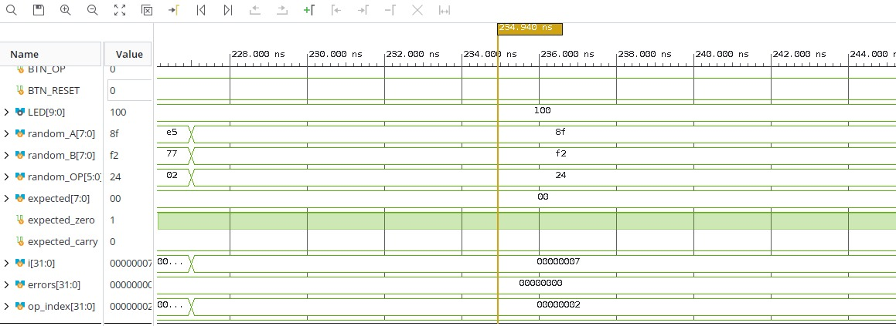
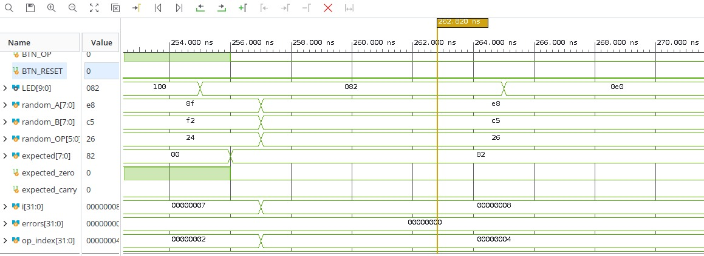
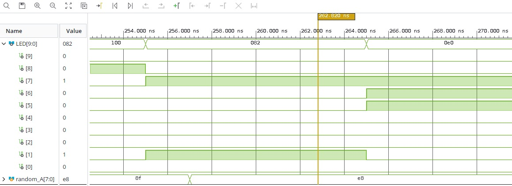

# Trabajo Práctico 1: Implementación de una ALU en FPGA

## Introducción

El objetivo del primer trabajo práctico de Arquitectura de Computadoras fue implementar una Unidad Aritmético Lógica (ALU) en FPGA. La ALU desarrollada permite ejecutar operaciones aritméticas, lógicas y de desplazamiento sobre dos operandos de entrada.

Uno de los requisitos principales del trabajo fue que el diseño fuera parametrizable en el ancho del bus de datos, de manera que pueda reutilizarse posteriormente en el trabajo final. Para cumplir con esto, los módulos principales utilizan parámetros como `NB_DATA`, `NB_OP`, `NSW` y `NLED`, evitando fijar todos los tamaños directamente en el código.

El proyecto también incluye un testbench con generación de entradas aleatorias y chequeo automático de resultados, lo que permite validar funcionalmente el comportamiento del diseño antes de llevarlo a la FPGA.

## Organización del proyecto

El trabajo se organizó dentro de la carpeta `TP1/`, separando los archivos fuente, el testbench y las restricciones físicas del dispositivo:

| Carpeta            | Contenido                                                  |
| ------------------ | ---------------------------------------------------------- |
| `TP1/source/`      | Módulos Verilog sintetizables del diseño.                  |
| `TP1/testbench/`   | Banco de pruebas utilizado para la simulación.             |
| `TP1/constraints/` | Archivo de restricciones para asignación de pines y reloj. |

Los archivos principales son:

| Archivo           | Descripción                                                 |
| ----------------- | ----------------------------------------------------------- |
| `ALU.v`           | Implementa la ALU parametrizable.                           |
| `TOP.v`           | Integra la ALU con switches, botones y LEDs de la placa.    |
| `NBITS_DATA.v`    | Implementa registros parametrizables para almacenar datos.  |
| `TOP_TB.v`        | Testbench con pruebas aleatorias y verificación automática. |
| `constraints.xdc` | Define pines, estándar eléctrico y reloj de 100 MHz.        |

## Descripción del diseño

### Módulo ALU

El módulo `ALU` recibe dos operandos `_A` y `_B`, junto con un código de operación `_OP`. El ancho de los operandos se define mediante el parámetro `NB_DATA`, mientras que el ancho del código de operación se define mediante `NB_OP`.

La ALU implementa las siguientes operaciones:

| Operación | Código   | Descripción                          |
| --------- | -------- | ------------------------------------ |
| `ADD`     | `100000` | Suma entre `_A` y `_B`.              |
| `SUB`     | `100010` | Resta `_A - _B`.                     |
| `AND`     | `100100` | AND bit a bit.                       |
| `OR`      | `100101` | OR bit a bit.                        |
| `XOR`     | `100110` | XOR bit a bit.                       |
| `SRA`     | `000011` | Desplazamiento aritmético a derecha. |
| `SRL`     | `000010` | Desplazamiento lógico a derecha.     |
| `NOR`     | `100111` | NOR bit a bit.                       |

Además del resultado principal `o_result`, el módulo genera dos señales de estado:

- `o_zero`: se activa cuando el resultado es cero.
- `o_carry`: indica acarreo en la suma y préstamo en la resta.

Para la suma se utiliza un resultado extendido de `NB_DATA + 1` bits, lo que permite conservar el bit de acarreo. En la resta, el indicador `o_carry` se utiliza como borrow y se activa cuando `_A < _B`.

La lógica de la ALU es combinacional, ya que se encuentra dentro de un bloque `always @(*)`. Esto significa que el resultado cambia en función de las entradas actuales sin necesidad de esperar un flanco de reloj.

### Módulo NBITS_DATA

El módulo `NBITS_DATA` implementa un registro parametrizable. Su función es almacenar un dato de entrada cuando la señal `i_enable` está activa en un flanco positivo de reloj.

También posee una señal `i_reset`, que limpia el registro y deja la salida en cero. Este módulo se utiliza para guardar los operandos `A`, `B` y el código de operación antes de enviarlos a la ALU.

El uso de este módulo evita duplicar lógica de almacenamiento y facilita la reutilización del diseño con distintos anchos de datos.

### Módulo TOP

El módulo `TOP` integra el sistema completo. Recibe como entradas el reloj `CLK`, los switches `SW`, los botones `BTN_A`, `BTN_B`, `BTN_OP` y el botón `BTN_RESET`.

Internamente instancia tres registros `NBITS_DATA`:

- uno para almacenar el operando `A`;
- uno para almacenar el operando `B`;
- uno para almacenar el código de operación `OP`.

Luego instancia la ALU y conecta su salida a los LEDs de la placa. Los bits bajos de `LED` muestran el resultado de la operación, mientras que `LED[8]` indica la bandera `zero` y `LED[9]` indica la bandera `carry` o `borrow`.

De esta manera, el usuario puede cargar operandos y operaciones desde los switches, confirmar cada carga con los botones y observar el resultado directamente en los LEDs.

## Restricciones físicas

El archivo `constraints.xdc` define la asignación de pines necesaria para utilizar el diseño en la placa FPGA. Se configuran:

- el reloj principal `CLK`, con un período de 10 ns, equivalente a 100 MHz;
- los 8 switches de entrada `SW[7:0]`;
- los botones para cargar `A`, `B`, `OP` y reiniciar los registros;
- los 10 LEDs de salida.

También se establece el estándar eléctrico `LVCMOS33` para las señales de entrada y salida.

## Validación mediante testbench

La validación funcional se realizó mediante el archivo `TOP_TB.v`. Este testbench instancia el módulo `TOP` y simula el uso de la placa mediante señales equivalentes al reloj, switches y botones.

El banco de pruebas genera un reloj con período de 10 ns, equivalente a una frecuencia de 100 MHz. Al inicio de la simulación se aplica un reset para inicializar los registros internos.

Luego se ejecutan 1000 pruebas aleatorias. En cada iteración se generan operandos aleatorios `A` y `B`, y se selecciona aleatoriamente una de las ocho operaciones soportadas por la ALU. Después, el testbench simula la carga de cada valor usando los botones correspondientes.

Para verificar el resultado, el testbench calcula el valor esperado con funciones auxiliares:

- `calculate_expected`, que calcula el resultado esperado de la operación;
- `calculate_expected_carry`, que calcula el acarreo o préstamo esperado.

Finalmente, compara automáticamente el resultado obtenido en los LEDs contra el resultado esperado. Si existe una diferencia, muestra un mensaje de error con los valores de entrada, la operación, el resultado obtenido y el resultado esperado. Al finalizar, informa si las 1000 pruebas fueron correctas o si se detectaron errores.

Este enfoque permite validar el comportamiento funcional del diseño sin revisar manualmente cada caso de prueba.

## Simulación y análisis temporal

El análisis temporal post-implementación se realizó en Vivado una vez finalizado el proceso de ruteo del diseño. El reporte no presenta violaciones temporales, ya que no se registran endpoints con fallos en los chequeos de setup, hold ni ancho de pulso. Tanto el Total Negative Slack de setup como el de hold son de 0 ns, mientras que el Worst Pulse Width Slack es de 4,5 ns, lo que indica que la señal de reloj cumple con los requisitos mínimos de duración de pulso. Vivado también informa que todas las restricciones temporales especificadas por el usuario se cumplen. Los valores infinitos de slack para setup y hold se deben a que el diseño no posee caminos completamente restringidos entre registros, ya que la salida de la ALU se conecta directamente a los LEDs de la FPGA.

## Waveform de la simulación

Luego de ejecutar el testbench observamos si se cumplian las operaciones con los valores de ingreso aleatoreos en los LEDs.

En esta imagen se logra ver que los datos ingresado son `random_A` = 8f (10001111), `random_B` = f2 (11110010), y `random_OP` = 24 (100100) equivalente a una operacion `AND`. 

En el ciclo siguiente se puede ver el resultado en `LED` = 82 (10000010) que es igual al resultado esperado `expected`.

Tambien se podemos ver la salida en cada bit de los leds.

## Conclusión

Se implementó una ALU parametrizable en Verilog capaz de realizar operaciones aritméticas, lógicas y de desplazamiento. El diseño se integró en un módulo superior que permite cargar operandos y operaciones desde switches y botones, y visualizar el resultado junto con las banderas de estado en LEDs.

La incorporación del módulo `NBITS_DATA` permitió separar la lógica de almacenamiento de la lógica combinacional de la ALU, mejorando la organización del diseño. Además, el testbench desarrollado cumple con el requisito de generar entradas aleatorias y realizar chequeo automático de resultados.
